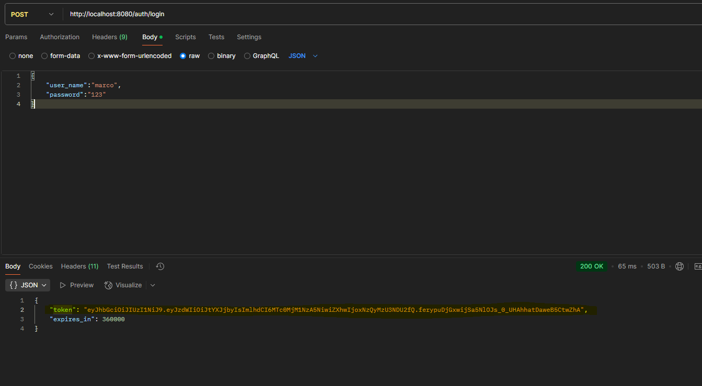
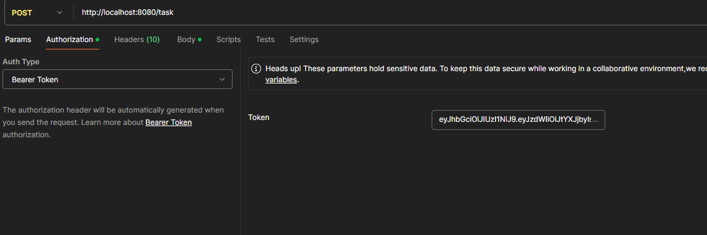
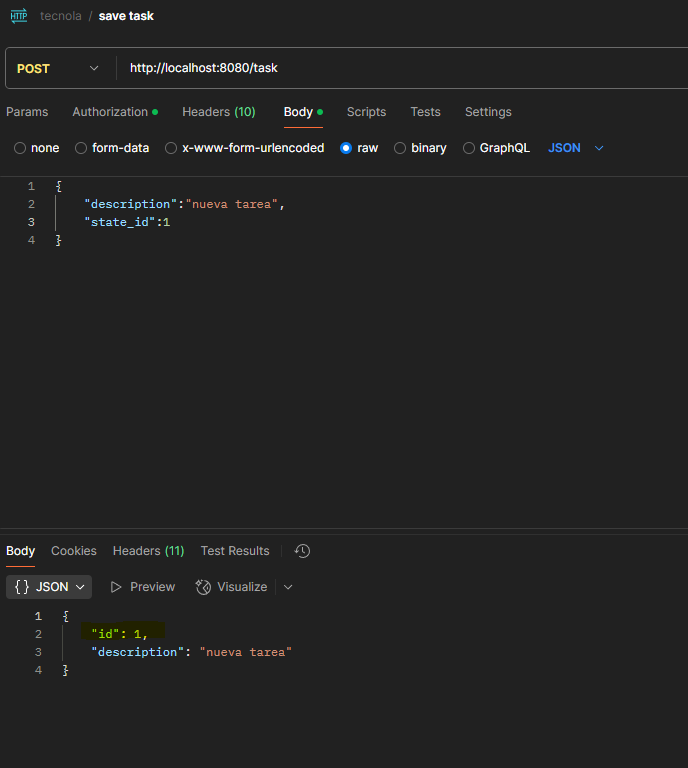
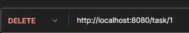
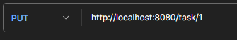
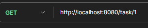

# Instrucciones para ejecutar y probar la API de Gestión de Tareas

Este documento proporciona instrucciones detalladas sobre cómo ejecutar y probar la API de Gestión de Tareas desarrollada para NUEVO SPA.

## Requisitos previos

- Java 17 o superior
- Maven 3.6.0 o superior
- Postman (opcional, para probar la API)

## Pasos para ejecutar la aplicación

### 1. Clonar el repositorio

```bash
git clone <URL_DEL_REPOSITORIO>
cd desafio-spring-boot
```

### 2. Compilar el proyecto

```bash
./mvnw clean package
```

### 3. Ejecutar la aplicación

```bash
./mvnw spring-boot:run
```

La aplicación se iniciará en `http://localhost:8080` con el contexto `/`.

## Acceso a la documentación de la API

Una vez que la aplicación esté en ejecución, puedes acceder a la documentación de la API a través de Swagger UI:

```
http://localhost:8080/swagger-ui/index.html#/
```

## Usuarios predefinidos

La aplicación viene con tres usuarios predefinidos :

1. **usuario uno**:
    - user_name: `marco`
    - password: `123`


2. **usuario dos**:
    - user_name: `mateo`
    - password: `1234`

3. **usuario tres**:
    - user_name: `ana`
    - password: `12345`
 

## Probar la API con Postman

Se incluye una colección de Postman (`api_tarea.postman_collection.json`) que contiene ejemplos de todas las solicitudes disponibles en la API. Para utilizarla:

1. Importa la colección en Postman


### Flujo de prueba recomendado:

1. Ejecuta la solicitud "login" para obtener un token JWT ,
   
2. Copiar el token generado en el paso anterior para usarlo en los end point
   de task , para cada consumo a los end point debemos copiar el token y pegar en la authorization
   `ejemplo:`
   

2. Una vez copiado el token procedemos a crear una nueva tarea con la solicitud "Save Task", cabe indicar que se puede usar los siguientes estados:
   
   -  1 -->**PROGRESS**
   -  2 -->**INCOMPLETE**
   -  3 -->**COMPLETE**

3. posteriormente ejecutado ***save task*** Copia el ID de la tarea creada (disponible en el body de respuesta campo "id")
   

4. Prueba las demás operaciones CRUD con el Id generado,
   **reemplazar :** `task/{id}` por el numero de tarea que necesite realizar la operacion
   `ejemplo:` ***id=1***
    - 
    - 
    - 
## Enfoque API First

Este proyecto sigue el enfoque API First, donde primero se define la API mediante un archivo OpenAPI (YAML) y luego se genera código a partir de él. El archivo de definición se encuentra en:

```
src/main/resources/openapi.yml
```

Para regenerar el código a partir de la definición OpenAPI, ejecuta:

```bash
./mvnw clean generate-sources
```

## Estructura del proyecto

- `src/main/java/com/tecnova/task/api/generated`: Interfaces generadas a partir de la definición OpenAPI
- `src/main/java/com/tecnova/task/dto/generated`: DTOs generados a partir de la definición OpenAPI
- `src/main/java/com/tecnova/task/api/controller`: Implementaciones de los delegados de la API
- `src/main/java/com/tecnova/task/api/model`: Entidades JPA
- `src/main/java/com/tecnova/task/api/repository`: Repositorios JPA
- `src/main/java/com/tecnova/task/api/service`: Servicios de negocio
- `src/main/java/com/tecnova/task/api/config/security`: Configuración de seguridad y JWT

## Base de datos

La aplicación utiliza una base de datos H2 en memoria. Puedes acceder a la consola H2 en:

```
http://localhost:8080/h2-console
```

Configuración de conexión:
- JDBC URL: `jdbc:h2:mem:task`
- Usuario: `sa`
- Contraseña: (dejar en blanco) 